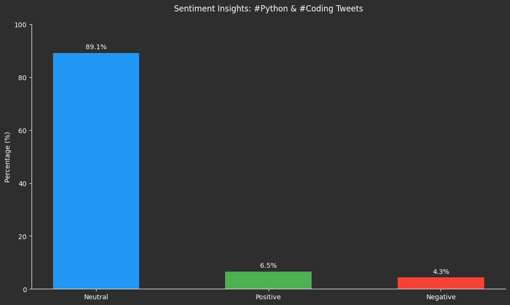
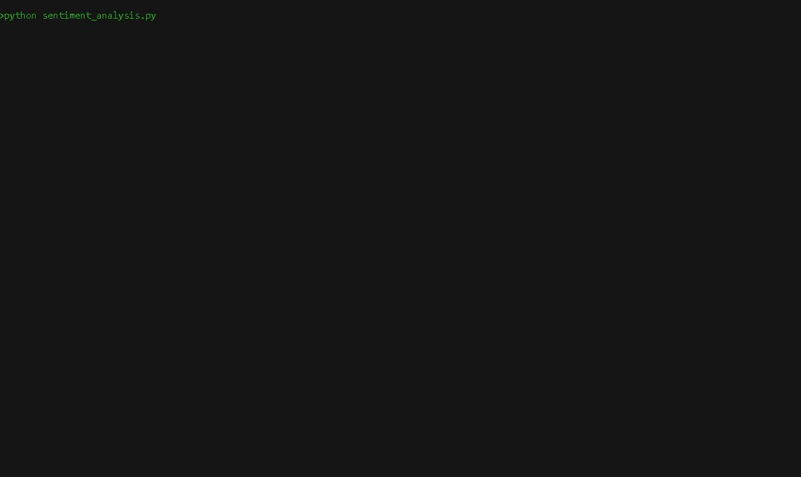
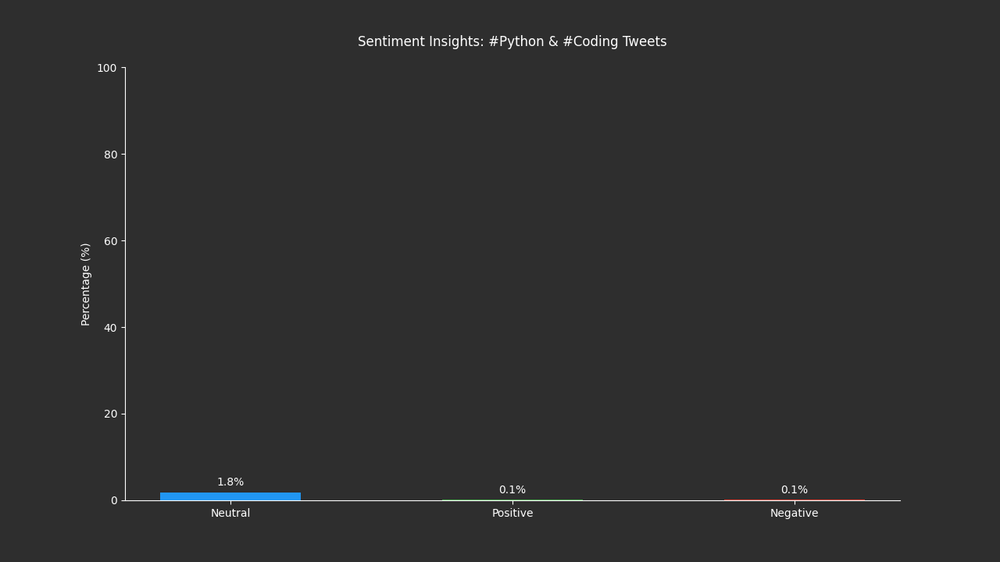

# Tweet Sentiment Bot

Analyzes the sentiment of tweets with hashtags #Python or #Coding.

## Sentiment Analysis
- Processed 50 tweets (46 analyzed, 4 skipped due to mentions).
- Distribution: Positive (3), Negative (2), Neutral (41).

## Setup
- Install Python 3.12.7 and create a virtual environment:

  python -m venv venv
  venv\Scripts\activate

- Install dependencies using `requirements.txt`:

  pip install -r requirements.txt

- Note: Ensure `PyQt5` is installed (`pip install PyQt5`) for visualization.
- Create a `.env` file in the project directory with the following:

  BEARER_TOKEN=your_x_bearer_token
  HF_TOKEN=your_huggingface_token

- `BEARER_TOKEN`: Obtain from the X Developer Portal.
- `HF_TOKEN`: Obtain from Hugging Face for model access.

## Usage
- Collect tweets:

  python poll_tweets.py

- Collects 50 tweets with hashtags #Python or #Coding and saves them to `tweets.txt`.
- Analyze sentiment:

  python sentiment_analysis.py

- Analyzes tweets in `tweets.txt` and saves results to `sentiment_results.txt`.
- Visualize results:

  python visualize_sentiment.py

- Generates a bar chart (`sentiment_chart.png`) and an animated chart (`animated_sentiment_chart.gif`) of sentiment distribution, saved in `outputs/`.

## Visualization
**Figure 1: Sentiment Insights: #Python & #Coding Tweets**

## Demo

## Why TweetSentimentBot?
- 🤖 AI-powered: Uses Hugging Face NLP for accurate sentiment analysis.
- ⏰ Real-time: Streams X posts as they happen.
- 📊 Visual: See sentiment trends with live charts.
- 🔔 Alerts: Get notified of sentiment shifts.

## Example
Tracked #Python and found 89.1% neutral sentiment! See the live chart in the demo above.

## Author
GitHub: [TechWire1034](https://github.com/TechWire1034)

## Ethical Considerations
TweetSentimentBot is designed for educational and demonstration purposes. Please use it responsibly and avoid manipulating or misrepresenting sentiment data. The bot only analyzes public posts and does not store or share private information.

## Disclaimer
This project is intended for educational and demonstration purposes. The author is not responsible for any misuse of the code or data. Use at your own risk.

## License
This project is licensed under the MIT License. See the [LICENSE](LICENSE) file for details.

