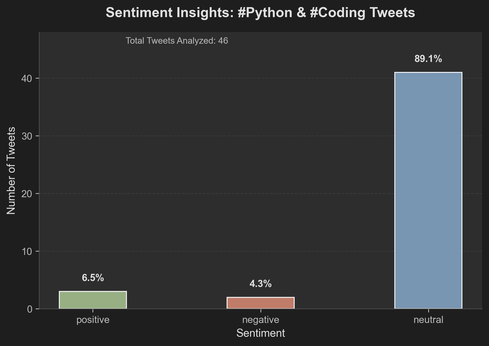

# Tweet Sentiment Bot

Analyzes the sentiment of tweets with hashtags #Python or #Coding.

## Sentiment Analysis
- Processed 50 tweets (46 analyzed, 4 skipped due to mentions).
- Distribution: Positive (3), Negative (2), Neutral (41).

## Setup
- Install Python 3.12.7 and create a virtual environment:
  ```
  python -m venv venv
  venv\Scripts\activate
  ```
- Install dependencies:
  ```
  pip install tweepy==4.15.0 transformers==4.51.3 matplotlib==3.10.3 python-dotenv==1.1.0 huggingface_hub==0.26.1
  ```
- Create a `.env` file in the project directory with the following:
  ```
  BEARER_TOKEN=your_x_bearer_token
  HF_TOKEN=your_huggingface_token
  ```
  - `BEARER_TOKEN`: Obtain from the X Developer Portal.
  - `HF_TOKEN`: Obtain from Hugging Face for model access.

## Usage
- Collect tweets:
  ```
  python poll_tweets.py
  ```
  - Collects 50 tweets with hashtags #Python or #Coding and saves them to `tweets.txt`.
- Analyze sentiment:
  ```
  python sentiment_analysis.py
  ```
  - Analyzes tweets in `tweets.txt` and saves results to `sentiment_results.txt`.
- Visualize results:
  ```
  python visualize_sentiment.py
  ```
  - Generates a bar chart of sentiment distribution, saved as `sentiment_chart.png`.

## Visualization
**Figure 1: Sentiment Insights: #Python & #Coding Tweets**

